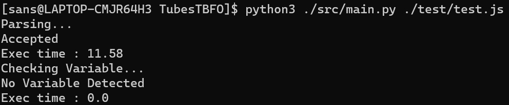

# TubesTBFO

Parser javascript (Node.js) menggunakan konsep CFG dan FA

 Disusun Oleh :

- 13521110 Yanuar Sano Nur Rasyid  
- 13521112 Rayhan Hanif Maulana Pradana  
- 13521173 Dewana Gustavus Haraka Otang

## Parser Bahasa JavaScript (Node.js)

> Implementasi parser untuk JavaScript (Node.js) untuk beberapa statement dan sintaks bawaan JavaScript menggunakan konsep CFG untuk pengerjaan parser yang mengevaluasi syntax program dan FA untuk nama variabel dan operasi (+, -, >, dll).

## Table of Contents

- [TubesTBFO](#tubestbfo)
  - [Parser Bahasa JavaScript (Node.js)](#parser-bahasa-javascript-nodejs)
  - [Table of Contents](#table-of-contents)
  - [Setup](#setup)
  - [Usage](#usage)
  - [Project Status](#project-status)
  - [Room for Improvement](#room-for-improvement)
<!-- * [License](#license) -->

## Setup

Program membutuhkan python agar dapat dijalankan

## Usage

Cara memulai aplikasi

1. Clone repository menggunakan command

   ```bash
    git clone https://github.com/yansans/TubesTBFO.git
   ```

2. Masuk ke folder utama dan jalankan main.py dari folder src

   ```bash
    cd  TubesTBFO
    python ./src/main.py
   ```

   Jalankan program dengan memasukkan command `python ./src/main.py <file.js>`

   contoh

   ```bash
    python ./src/main.py ./test/test.js
   ```

Screenshot Program


## Project Status

Project is: _complete_

## Room for Improvement

Room for improvement:

- Meningkatkan efisiensi algoritma
- Menambahkan lagi syntax _javascript_ yang bisa di-_parsing_

<!-- Optional -->
<!-- ## License -->
<!-- This project is open source and available under the [... License](). -->

<!-- You don't have to include all sections - just the one's relevant to your project -->
